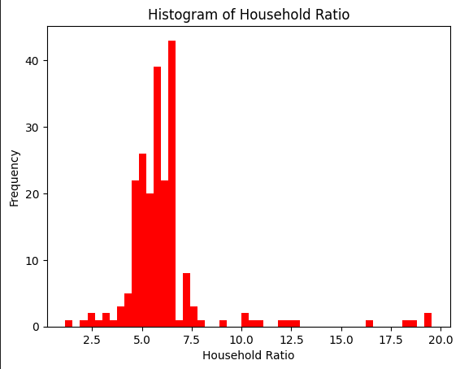

# ML PROJECTS

Steps to run:

<ol>
    <li>git clone the repo</li>
    <li>Set up the virtual env</li>
    <ul>
    <li>pip install virtualenv</li>
    <li>virtualenv myenv</li>
    <li>source myenv/bin/activate</li>
    </ul>
    <li>pip install -r requirements.txt</li>
    <li>Now you can run the files</li>
</ol>
<h2>
<a href='./food-wastage/'>Food Wastage Project</a>
</h2>
<b>Some Outputs:</b>  

